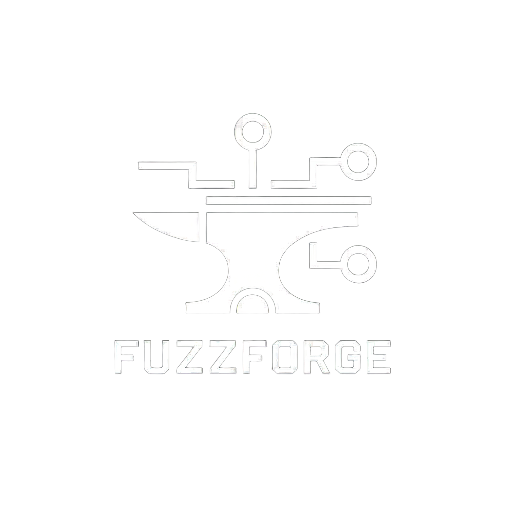

<p align="center">
  
</p>
<h1 align="center">FuzzForge 🚧</h1>

<p align="center"><strong>AI-powered workflow automation and AI Agents for AppSec, Fuzzing & Offensive Security</strong></p>

<p align="center">
  <a href="https://discord.com/invite/acqv9FVG"></a>
  <a href="LICENSE"></a>
  <a href="https://www.python.org/downloads/"></a>
  <a href="https://fuzzforge.ai"></a>
  
</p>

<p align="center">
  <sub>
    <a href="#-overview"><b>Overview</b></a>
    • <a href="#-key-features"><b>Features</b></a>
    • <a href="#-installation"><b>Installation</b></a>
    • <a href="#-quickstart"><b>Quickstart</b></a>
    • <a href="#ai-powered-workflow-execution"><b>Demo</b></a>
    • <a href="#-contributing"><b>Contributing</b></a>
  </sub>
</p>

---

## 🚀 Overview

**FuzzForge** helps security researchers and engineers automate **application security** and **offensive security** workflows with the power of AI and fuzzing frameworks.

- Orchestrate static & dynamic analysis  
- Automate vulnerability research  
- Scale AppSec testing with AI agents  
- Build, share & reuse workflows across teams  

FuzzForge is **open source**, built to empower security teams, researchers, and the community.

> 🚧 FuzzForge is still a work in progress, you can [subscribe]() to get the latest news.

---

## ✨ Key Features

- 🤖 **AI Agents for Security** – Specialized agents for AppSec, reversing, and fuzzing  
- 🛠 **Workflow Automation** – Define & execute AppSec workflows as code  
- 📈 **Vulnerability Research at Scale** – Rediscover 1-days & find 0-days with automation  
- 🔗 **Fuzzer Integration** – AFL, Honggfuzz, AFLnet, StateAFL & more  
- 🌐 **Community Marketplace** – Share workflows, corpora, PoCs, and modules  
- 🔒 **Enterprise Ready** – Team/Corp cloud tiers for scaling offensive security  

---

## 📦 Installation

### Requirements

**Python 3.11+**
Python 3.11 or higher is required.

**uv Package Manager**
```bash
curl -LsSf https://astral.sh/uv/install.sh | sh
```

**Docker**
For containerized workflows, see the [Docker Installation Guide](https://docs.docker.com/get-docker/).

### CLI Installation

After installing the requirements, install the FuzzForge CLI:

```bash
# Clone the repository
git clone https://github.com/fuzzinglabs/fuzzforge_ai.git
cd fuzzforge_ai

# Install CLI with uv (from the root directory)
uv tool install --python python3.12 .
```

---

## ⚡ Quickstart

Run your first workflow in **3 steps**:

```bash
# 1. Clone the repo
git clone https://github.com/fuzzinglabs/fuzzforge.git
cd fuzzforge

# 2. Build & run with Docker
# Set registry host for your OS (local registry is mandatory)
# macOS/Windows (Docker Desktop):
export REGISTRY_HOST=host.docker.internal
# Linux (default):
# export REGISTRY_HOST=localhost
docker compose up -d
```

> The first launch can take 5-10 minutes due to Docker image building - a good time for a coffee break ☕

```bash
# 3. Run your first workflow
cd test_projects/vulnerable_app/ # Go into the test directory
fuzzforge init # Init a fuzzforge project
ff workflow security_assessment . # Start a workflow (you can also use ff command)
```

### Manual Workflow Setup


*Setting up and running security workflows through the interface*

👉 More installation options in the [Documentation](https://fuzzforge.ai/docs).

---

## AI-Powered Workflow Execution


*AI agents automatically analyzing code and providing security insights*

## 📚 Resources

- 🌐 [Website](https://fuzzforge.ai)  
- 📖 [Documentation](https://fuzzforge.ai/docs)  
- 💬 [Community Discord](https://discord.com/invite/acqv9FVG)  
- 🎓 [FuzzingLabs Academy](https://academy.fuzzinglabs.com/?coupon=GITHUB_FUZZFORGE)  

---

## 🤝 Contributing

We welcome contributions from the community!  
Check out our [Contributing Guide](CONTRIBUTING.md) to get started.

---

## 📜 License

FuzzForge is released under the **Business Source License (BSL) 1.1**, with an automatic fallback to **Apache 2.0** after 4 years.  
See [LICENSE](LICENSE) and [LICENSE-APACHE](LICENSE-APACHE) for details.
