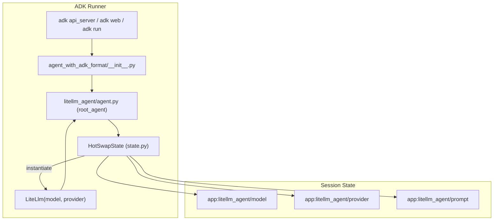
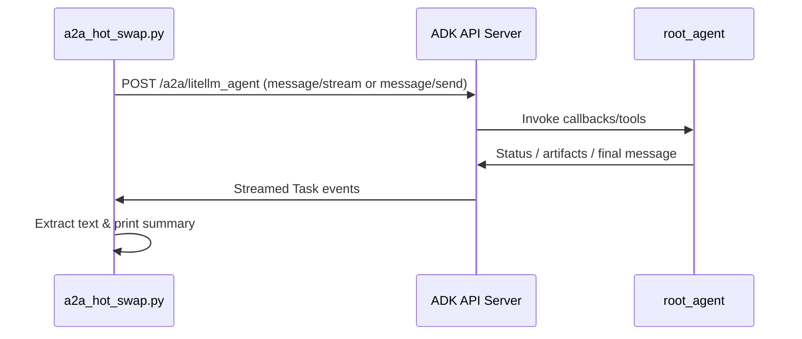

# Architecture Overview

This package is a minimal ADK agent that keeps runtime behaviour and A2A access in separate layers so it can double as boilerplate.

## Directory Layout

```text
agent_with_adk_format/
├── __init__.py               # Exposes root_agent for ADK runners
├── a2a_hot_swap.py           # JSON-RPC helper for model/prompt swaps
├── README.md, QUICKSTART.md  # Operational docs
├── ARCHITECTURE.md           # This document
├── .env                      # Active environment (gitignored)
├── .env.example              # Environment template
└── litellm_agent/
    ├── agent.py              # Root Agent definition (LiteLLM shell)
    ├── callbacks.py          # before_agent / before_model hooks
    ├── config.py             # Defaults, state keys, control prefix
    ├── control.py            # HOTSWAP command parsing/serialization
    ├── state.py              # Session state wrapper + LiteLLM factory
    ├── tools.py              # set_model / set_prompt / get_config
    ├── prompts.py            # Base instruction text
    └── agent.json            # A2A agent card (served under /.well-known)
```



## Runtime Flow (ADK Runners)

1. **Startup**: `adk api_server`/`adk web` imports `agent_with_adk_format`, which exposes `root_agent` from `litellm_agent/agent.py`. `.env` at package root is loaded before the runner constructs the agent.
2. **Session State**: `callbacks.py` and `tools.py` read/write through `state.py`. We store `model`, `provider`, and `prompt` keys (prefixed `app:litellm_agent/…`) which persist across turns.
3. **Instruction Generation**: `provide_instruction` composes the base persona from `prompts.py` plus any stored prompt override. The current model/provider is appended for observability.
4. **Model Hot-Swap**: When a control message is detected (`[HOTSWAP:MODEL:…]`) the callback parses it via `control.py`, updates the session state, and calls `state.apply_state_to_agent` to instantiate a new `LiteLlm(model=…, custom_llm_provider=…)`. ADK runners reuse that instance for subsequent turns.
5. **Prompt Hot-Swap**: Similar path (`set_prompt` tool/callback) updates state; the dynamic instruction immediately reflects the change.
6. **Config Reporting**: Both the callback and the tool surface the summary string produced by `HotSwapState.describe()`, ensuring CLI, A2A, and UI all show the same data.

## A2A Integration

- `agent.json` defines the agent card and enables ADK to register `/a2a/litellm_agent` routes when launched with `--a2a`.
- `a2a_hot_swap.py` uses `a2a.client.A2AClient` to programmatically send control messages and user text via JSON-RPC. It supports streaming when available and falls back to blocking requests otherwise.



## Extending the Boilerplate

- Add tools under `litellm_agent/tools.py` and register them in `agent.py` to expose new capabilities.
- Use `state.py` to track additional configuration or session data (store under your own prefix to avoid collisions).
- When layering business logic, prefer expanding callbacks or adding higher-level agents while leaving the hot-swap mechanism untouched for reuse.
