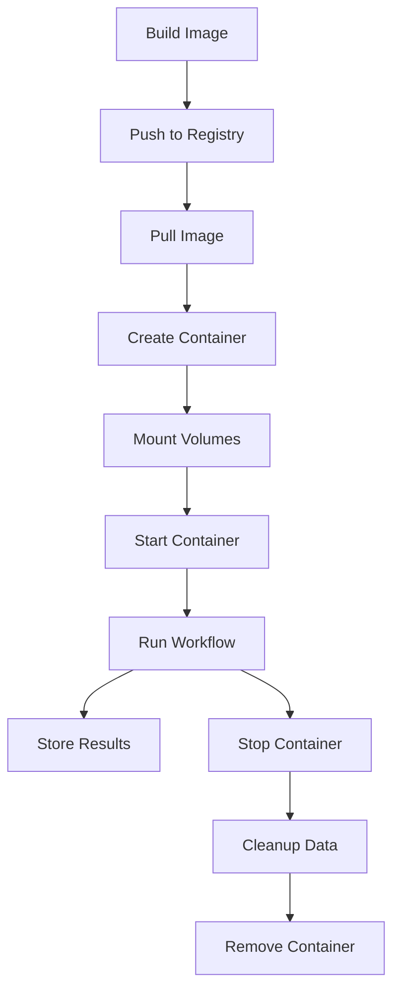

# Docker Containers in FuzzForge: Concept and Design

Docker containers are at the heart of FuzzForge’s execution model. They provide the isolation, consistency, and flexibility needed to run security workflows reliably—no matter where FuzzForge is deployed. This page explains the core concepts behind container usage in FuzzForge, why containers are used, and how they shape the platform’s behavior.

---

## Why Use Docker Containers?

FuzzForge relies on Docker containers for several key reasons:

- **Isolation:** Each workflow runs in its own container, so tools and processes can’t interfere with each other or the host.
- **Consistency:** The environment inside a container is always the same, regardless of the underlying system.
- **Security:** Containers restrict access to host resources and run as non-root users.
- **Reproducibility:** Results are deterministic, since the environment is controlled and versioned.
- **Scalability:** Containers can be started, stopped, and scaled up or down as needed.

---

## How Does FuzzForge Use Containers?

### The Container Model

Every workflow in FuzzForge is executed inside a Docker container. Here’s what that means in practice:

- **Workflow containers** are built from language-specific base images (like Python or Node.js), with security tools and workflow code pre-installed.
- **Infrastructure containers** (API server, Prefect, database) use official images and are configured for the platform’s needs.

### Container Lifecycle: From Build to Cleanup

The lifecycle of a workflow container looks like this:

1. **Image Build:** A Docker image is built with all required tools and code.
2. **Image Push/Pull:** The image is pushed to (and later pulled from) a local or remote registry.
3. **Container Creation:** The container is created with the right volumes and environment.
4. **Execution:** The workflow runs inside the container.
5. **Result Storage:** Results are written to mounted volumes.
6. **Cleanup:** The container and any temporary data are removed.



---

## What’s Inside a Workflow Container?

A typical workflow container is structured like this:

- **Base Image:** Usually a slim language image (e.g., `python:3.11-slim`).
- **System Dependencies:** Installed as needed (e.g., `git`, `curl`).
- **Security Tools:** Pre-installed (e.g., `semgrep`, `bandit`, `safety`).
- **Workflow Code:** Copied into the container.
- **Non-root User:** Created for execution.
- **Entrypoint:** Runs the workflow code.

Example Dockerfile snippet:

```dockerfile
FROM python:3.11-slim
RUN apt-get update && apt-get install -y git curl && rm -rf /var/lib/apt/lists/*
RUN pip install semgrep bandit safety
COPY ./toolbox /app/toolbox
WORKDIR /app
RUN useradd -m -u 1000 fuzzforge
USER fuzzforge
CMD ["python", "-m", "toolbox.main"]
```

---

## How Are Containers Networked and Connected?

- **Docker Compose Network:** All containers are attached to a custom bridge network for internal communication.
- **Internal DNS:** Services communicate using Docker Compose service names.
- **Port Exposure:** Only necessary ports are exposed to the host.
- **Network Isolation:** Workflow containers are isolated from infrastructure containers when possible.

Example network config:

```yaml
networks:
  fuzzforge:
    driver: bridge
    ipam:
      config:
        - subnet: 172.20.0.0/16
```

---

## How Is Data Managed with Volumes?

### Volume Types

- **Target Code Volume:** Mounts the code to be analyzed, read-only, into the container.
- **Result Volume:** Stores workflow results and artifacts, persists after container exit.
- **Temporary Volumes:** Used for scratch space, destroyed with the container.

Example volume mount:

```yaml
volumes:
  - "/host/path/to/code:/app/target:ro"
  - "fuzzforge_prefect_storage:/app/prefect"
```

### Volume Security

- **Read-only Mounts:** Prevent workflows from modifying source code.
- **Isolated Results:** Each workflow writes to its own result directory.
- **No Arbitrary Host Access:** Only explicitly mounted paths are accessible.

---

## How Are Images Built and Managed?

- **Automated Builds:** Images are built and pushed to a local registry for development, or a secure registry for production.
- **Build Optimization:** Use layer caching, multi-stage builds, and minimal base images.
- **Versioning:** Use tags (`latest`, semantic versions, or SHA digests) to track images.

Example build and push:

```bash
docker build -t localhost:5001/fuzzforge-static-analysis:latest .
docker push localhost:5001/fuzzforge-static-analysis:latest
```

---

## How Are Resources Controlled?

- **Memory and CPU Limits:** Set per container to prevent resource exhaustion.
- **Resource Monitoring:** Use `docker stats` and platform APIs to track usage.
- **Alerts:** Detect and handle out-of-memory or CPU throttling events.

Example resource config:

```yaml
services:
  prefect-worker:
    deploy:
      resources:
        limits:
          memory: 4G
          cpus: '2.0'
        reservations:
          memory: 1G
          cpus: '0.5'
```

---

## How Is Security Enforced?

- **Non-root Execution:** Containers run as a dedicated, non-root user.
- **Capability Restrictions:** Drop unnecessary Linux capabilities.
- **Filesystem Protection:** Use read-only filesystems and tmpfs for temporary data.
- **Network Isolation:** Restrict network access to only what’s needed.
- **No Privileged Mode:** Containers never run with elevated privileges.

Example security options:

```yaml
services:
  prefect-worker:
    security_opt:
      - no-new-privileges:true
    cap_drop:
      - ALL
    cap_add:
      - CHOWN
      - SETGID
      - SETUID
```

---

## How Is Performance Optimized?

- **Image Layering:** Structure Dockerfiles for efficient caching.
- **Dependency Preinstallation:** Reduce startup time by pre-installing dependencies.
- **Warm Containers:** Optionally pre-create containers for faster workflow startup.
- **Horizontal Scaling:** Scale worker containers to handle more workflows in parallel.

---

## How Are Containers Monitored and Debugged?

- **Health Checks:** Each service and workflow container has a health endpoint or check.
- **Logging:** All container logs are collected and can be accessed via `docker logs` or the FuzzForge API.
- **Debug Access:** Use `docker exec` to access running containers for troubleshooting.
- **Resource Stats:** Monitor with `docker stats` or platform dashboards.

---

## How Does This All Fit Into FuzzForge?

- **Prefect Workers:** Manage the full lifecycle of workflow containers.
- **API Integration:** Exposes container status, logs, and resource metrics.
- **Volume Management:** Ensures results and artifacts are collected and persisted.
- **Security and Resource Controls:** Enforced automatically for every workflow.

---

## In Summary

Docker containers are the foundation of FuzzForge’s execution model. They provide the isolation, security, and reproducibility needed for robust security analysis workflows—while making it easy to scale, monitor, and extend the platform.
