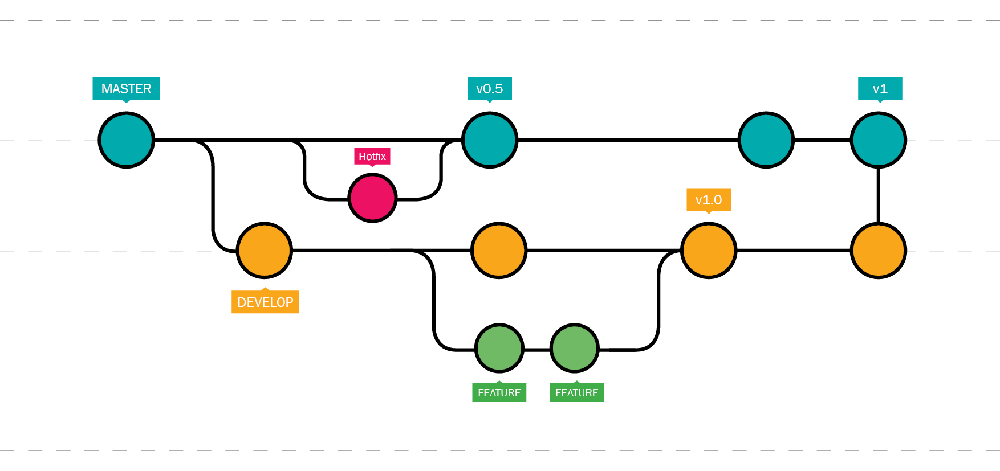

# Contributing

Contributing is much appreciated.

## How to contribute

### Development environment setup

We recommand using the excellent [Based Pyright](https://docs.basedpyright.com/latest/) LSP, which is a fork of [pyright](https://github.com/microsoft/pyright) with various type checking improvements, pylance features and more. It is available in all major editors (VSCode, Vim, Emacs, Zed).

To work on the project, you will need to install `uv`. Check the [installation instructions](https://docs.astral.sh/uv/getting-started/installation/) for your platform.

We also recommand using Just to manage your development environment. Just is a command runner, similar to Make, but with a simpler syntax and more features. It is available in all major platforms. Check the [installation instructions](https://just.systems/man/en/) for your platform. We wrapped on number of useful commands in the `Justfile` at the root of the repository. You can see the available commands by running `just`.

### Code conventions

We try to follow the [Python Style Guide](https://www.python.org/dev/peps/pep-0008/) and [Google Python Style Guide](https://github.com/google/styleguide/blob/gh-pages/pyguide.md) for Python code. A linter and formatter is used to ensure that the code is consistent and follows the style guide. The linter and formatter used is [Ruff](https://docs.astral.sh/ruff/).

### Git usage

We use the [Conventional Commits 1.0.0](https://www.conventionalcommits.org/en/v1.0.0/) specification to format our commits.

As for our workflow, we use the following with the following branch names :

- main : `main` - for production code
  - hotfix : `hotfix/<hotfix name>` - for urgent fixes to the production code
- develop : `dev` - for development
  - feature : `feat/<feature name>` - for new features
  - continuous integration : `ci/<ci name>` - for continuous integration related changes
  - documentation : `docs/<documentation name>` - for documentation changes
  - fix : `fix/<bug name>` - for bug fixes
  - chore : `chore/<chore name>` - for changes that do not modify src or test files
  - refactor : `refactor/<refactor name>` - for code refactoring
  - perf : `perf/<performance name>` - for performance improvements
  - test : `test/<test name>` - for adding or modifying tests
  - build : `build/<build name>` - for build-related changes
  - revert : `revert/<revert name>` - for reverting changes
  - style : `style/<style name>` - for style-related changes

In addition to the branching names, only `dev` and `hotfix` branches are allowed to be merged into `main`. All other branches must be merged into `dev` first.

The `dev` branch is the main development branch, and all new features and bug fixes should be merged into it. The `main` branch is the production branch, and only stable code should be merged into it.

The `hotfix` branch is used for urgent fixes to the production code, and should be merged into both `main` and `dev` branches.

This workflow is derived from the [Git Flow](https://nvie.com/posts/a-successful-git-branching-model/) workflow, with some modifications to fit our needs.

!!! note
    Following theses conventions allows for an automatic CI to label pull requests and commits with the correct labels. This can be used to automatically generate the changelog and release notes, but mainly facilitates the review process.

### Testing

We use [pytest](https://docs.pytest.org/en/latest/) for unit and integration testing, and [PyTestArch](https://pypi.org/project/PyTestArch/) for architectural rules. The tests are located in the `tests` directory.

A test is required for every new feature and bug fix. The tests should be located in the `tests` directory of the corresponding module.
The tests should be run before merging any changes into the `dev` or `main` branches.

### Continuous integration

We use [GitHub Actions](https://docs.github.com/en/actions) for continuous integration. The CI workflow is located in the `.github/workflows` directory.
The CI workflow is triggered on every push to the `dev` and `main` branches, and on every pull request to the `dev` and `main` branches.

The CI workflow runs the tests and linter, and builds the documentation. The CI workflow is required to pass before merging any changes into the `dev` or `main` branches.

### Bug report

To-do
